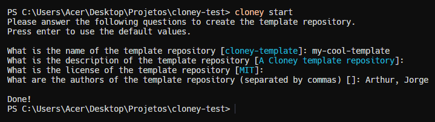
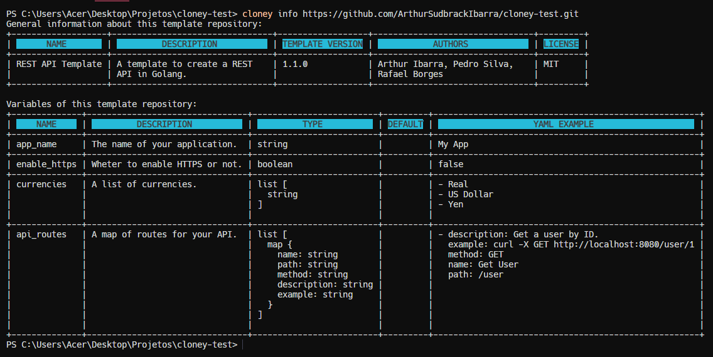
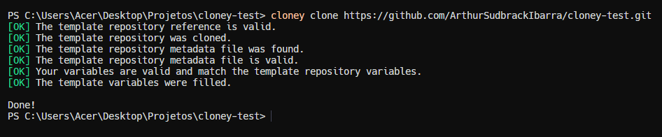
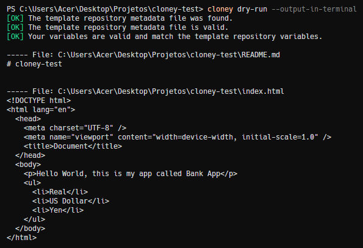

# Cloney Command-Line Interface (CLI)

The Cloney Command-Line Interface (CLI) is the tool you use to interact with Cloney Template Repositories. It offers a set of straightforward commands that enable you to manage, customize, and work with Cloney templates.

## Start Command

The `cloney start` command allows you to create a new Cloney Template Repository in the current directory. This command initializes the repository and prepares it for use as a Cloney template.

```bash
cloney start
```



## Info Command

The `cloney info` command provides information about a Cloney Template Repository. You can use it to retrieve details about a template repository in various ways:

- In the current directory:

  ```bash
  cloney info
  ```

- At a specific local path:

  ```bash
  cloney info /path/to/local/repository
  ```

- Using a remote URL:

  ```bash
  cloney info https://github.com/username/template-repo.git
  ```



## Clone Command

The `cloney clone` command allows you to clone a Cloney Template Repository with custom variable values. You can customize the cloning process by providing a variables file (e.g., `my-vars.yaml`) or specifying variables inline.

- Using a variables file:

  ```bash
  cloney clone https://github.com/username/template-repo.git -v my-vars.yaml
  ```

- Specifying variables inline:

  ```bash
  cloney clone https://github.com/username/template-repo.git -v '{ app_name: "MyApp", enable_https: true }'
  ```



## Dry Run Command

The `cloney dry-run` command is used to debug your own Cloney Template Repository. It allows you to see how variables are replaced and check for errors in the cloning process. You can pass variables to this command in the same way as the `clone` command.

```bash
cloney dry-run -v my-vars.yaml
```


